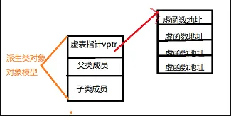
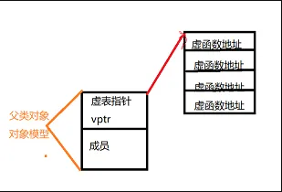

### 1. static 关键字的作用？
- 修饰全局变量或函数，限制作用范围，只可以在当前文件访问；
- 修饰局部变量，延长变量的生命周期为整个程序的生命周期，函数return 后变量不会释放；
- 在class中用于声明类成员或函数，类成员或函数可以直接通过类名访问无需创建对象；


### 2. new/delete与malloc/new的区别？
- malloc/new 是c语言标准库提供的一组用于动态申请释放内存的API；
- new/delete是c++语言标准库提供的一组用于动态创建/释放对象的操作符，在申请/释放内存的基础上还会额外调用构造/析构函数，是c++ RAII 实现的基础；
- new = malloc + 构造函数，delete =  析构函数 + free；


### 3. 假设有数组 int a[10], a、&a[0]与 &a 这3者的区别？
- a、&a[0]与 &a 都是一个指针代表一个内存，且值相同；
- 其中a 为数组名指向首元素地址即与&a[0] 相同，&a 为数组的指针，三者做运算时有差异：
  a+1 和 &a[0]+1 是内存地址偏移一个元素的位置(地址值+sizeof(int))，即指向第二个元素a[1], &a+1,  内存地址偏移一个数组的位置(地址值+sizeof(int)*10)


### 4. 宏与constexpr 区别?
- 宏用于定义常量和简单的代码片段，在预编译时期会被完整替换；
- constexpr 可以取代宏的功能，用来定义常量和函数；
- 宏没有类型安全检查，而constexpr有

### 5. extern "C" 
- c++ 为支持函数重载引入了name mangling 技术，将重载函数重新命名成唯一的标识符，如void foo(int) 函数名被修饰成_ZfooEi, 这样 c 代码link foo 函数时会失败；
- extern "C"  让c++ 代码编译时不使用name mangling，保持与c 语言一样的方式， 这样就可以解决c代码调用c++ 代码的存在的link 问题


### 6. const 关键字的作用？
- 定义常量，即被修饰变量不可以被修改；
- const& 用于函数穿参数
- 修饰成员函数表示函数体不会修改类成员（被mutable 修饰除外）

## 继承与多态
### C++的多态如何实现
C++的多态性，一言以蔽之就是：

在基类的函数前加上virtual关键字，在派生类中重写该函数，运行时将会根据所指对象的实际类型来调用相应的函数，如果对象类型是派生类，就调用派生类的函数，如果对象类型是基类，就调用基类的函数。

举个例子：
```cpp 
#include <iostream>
using namespace std;

class Base{
public:
    virtual void fun(){
        cout << " Base::func()" <<endl;
    }
};

class Son1 : public Base{
public:
    virtual void fun() override{
        cout << " Son1::func()" <<endl;
    }
};

class Son2 : public Base{

};

int main()
{
    Base* base = new Son1;
    base->fun();
    base = new Son2;
    base->fun();
    delete base;
    base = NULL;
    return 0;
}
// 运行结果
// Son1::func()
// Base::func()
```
例子中，Base为基类，其中的函数为虚函数。子类1继承并重写了基类的函数，子类2继承基类但没有重写基类的函数，从结果分析子类体现了多态性，那么为什么会出现多态性，其底层的原理是什么？这里需要引出虚表和虚基表指针的概念。

虚表：虚函数表的缩写，类中含有virtual关键字修饰的方法时，编译器会自动生成虚表

虚表指针：在含有虚函数的类实例化对象时，对象地址的前四个字节存储的指向虚表的指针




上图中展示了虚表和虚表指针在基类对象和派生类对象中的模型，下面阐述实现多态的过程：

(1)编译器在发现基类中有虚函数时，会自动为每个含有虚函数的类生成一份虚表，该表是一个一维数组，虚表里保存了虚函数的入口地址

(2)编译器会在每个对象的前四个字节中保存一个虚表指针，即vptr，指向对象所属类的虚表。在构造时，根据对象的类型去初始化虚指针vptr，从而让vptr指向正确的虚表，从而在调用虚函数时，能找到正确的函数

(3)所谓的合适时机，在派生类定义对象时，程序运行会自动调用构造函数，在构造函数中创建虚表并对虚表初始化。在构造子类对象时，会先调用父类的构造函数，此时，编译器只“看到了”父类，并为父类对象初始化虚表指针，令它指向父类的虚表；当调用子类的构造函数时，为子类对象初始化虚表指针，令它指向子类的虚表

(4)当派生类对基类的虚函数没有重写时，派生类的虚表指针指向的是基类的虚表；当派生类对基类的虚函数重写时，派生类的虚表指针指向的是自身的虚表；当派生类中有自己的虚函数时，在自己的虚表中将此虚函数地址添加在后面

这样指向派生类的基类指针在运行时，就可以根据派生类对虚函数重写情况动态的进行调用，从而实现多态性。

### 基类的虚函数表存放在内存的什么区，虚表指针vptr的初始化时间
首先整理一下虚函数表的特征：

虚函数表是全局共享的元素，即全局仅有一个，在编译时就构造完成

虚函数表类似一个数组，类对象中存储vptr指针，指向虚函数表，即虚函数表不是函数，不是程序代码，不可能存储在代码段

虚函数表存储虚函数的地址,即虚函数表的元素是指向类成员函数的指针,而类中虚函数的个数在编译时期可以确定，即虚函数表的大小可以确定,即大小是在编译时期确定的，不必动态分配内存空间存储虚函数表，所以不在堆中

根据以上特征，虚函数表类似于类中静态成员变量.静态成员变量也是全局共享，大小确定，因此最有可能存在全局数据区，测试结果显示：

虚函数表vtable在Linux/Unix中存放在可执行文件的只读数据段中(rodata)，这与微软的编译器将虚函数表存放在常量段存在一些差别

由于虚表指针vptr跟虚函数密不可分，对于有虚函数或者继承于拥有虚函数的基类，对该类进行实例化时，在构造函数执行时会对虚表指针进行初始化，并且存在对象内存布局的最前面。

### 构造函数和析构函数可以调用虚函数?
1) 在C++中，提倡不在构造函数和析构函数中调用虚函数；

2) 构造函数和析构函数调用虚函数时都不使用动态联编，如果在构造函数或析构函数中调用虚函数，则运行的是为构造函数或析构函数自身类型定义的版本；

3) 因为父类对象会在子类之前进行构造，此时子类部分的数据成员还未初始化，因此调用子类的虚函数时不安全的，故而C++不会进行动态联编；

4) 析构函数是用来销毁一个对象的，在销毁一个对象时，先调用子类的析构函数，然后再调用基类的析构函数。所以在调用基类的析构函数时，派生类对象的数据成员已经销毁，这个时候再调用子类的虚函数没有任何意义。

### 构造函数为什么不能为虚函数？析构函数为什么要虚函数？
1、 从存储空间角度，虚函数相应一个指向vtable虚函数表的指针，这大家都知道，但是这个指向vtable的指针事实上是存储在对象的内存空间的。

问题出来了，假设构造函数是虚的，就须要通过 vtable来调用，但是对象还没有实例化，也就是内存空间还没有，怎么找vtable呢？所以构造函数不能是虚函数。

2、 从使用角度，虚函数主要用于在信息不全的情况下，能使重载的函数得到相应的调用。

构造函数本身就是要初始化实例，那使用虚函数也没有实际意义呀。

所以构造函数没有必要是虚函数。虚函数的作用在于通过父类的指针或者引用来调用它的时候可以变成调用子类的那个成员函数。而构造函数是在创建对象时自己主动调用的，不可能通过父类的指针或者引用去调用，因此也就规定构造函数不能是虚函数。

3、构造函数不须要是虚函数，也不同意是虚函数，由于创建一个对象时我们总是要明白指定对象的类型，虽然我们可能通过实验室的基类的指针或引用去訪问它但析构却不一定，我们往往通过基类的指针来销毁对象。这时候假设析构函数不是虚函数，就不能正确识别对象类型从而不能正确调用析构函数。

4、从实现上看，vbtl在构造函数调用后才建立，因而构造函数不可能成为虚函数从实际含义上看，在调用构造函数时还不能确定对象的真实类型（由于子类会调父类的构造函数）；并且构造函数的作用是提供初始化，在对象生命期仅仅运行一次，不是对象的动态行为，也没有必要成为虚函数。

5、当一个构造函数被调用时，它做的首要的事情之中的一个是初始化它的VPTR。

因此，它仅仅能知道它是“当前”类的，而全然忽视这个对象后面是否还有继承者。当编译器为这个构造函数产生代码时，它是为这个类的构造函数产生代码——既不是为基类，也不是为它的派生类（由于类不知道谁继承它）。所以它使用的VPTR必须是对于这个类的VTABLE。

并且，仅仅要它是最后的构造函数调用，那么在这个对象的生命期内，VPTR将保持被初始化为指向这个VTABLE, 但假设接着另一个更晚派生的构造函数被调用，这个构造函数又将设置VPTR指向它的 VTABLE，等.直到最后的构造函数结束。

VPTR的状态是由被最后调用的构造函数确定的。这就是为什么构造函数调用是从基类到更加派生类顺序的还有一个理由。可是，当这一系列构造函数调用正发生时，每一个构造函数都已经设置VPTR指向它自己的VTABLE。假设函数调用使用虚机制，它将仅仅产生通过它自己的VTABLE的调用，而不是最后的VTABLE（全部构造函数被调用后才会有最后的VTABLE）。

因为构造函数本来就是为了明确初始化对象成员才产生的，然而virtual function主要是为了再不完全了解细节的情况下也能正确处理对象。另外，virtual函数是在不同类型的对象产生不同的动作，现在对象还没有产生，如何使用virtual函数来完成你想完成的动作。

直接的讲，C++中基类采用virtual虚析构函数是为了防止内存泄漏。

具体地说，如果派生类中申请了内存空间，并在其析构函数中对这些内存空间进行释放。假设基类中采用的是非虚析构函数，当删除基类指针指向的派生类对象时就不会触发动态绑定，因而只会调用基类的析构函数，而不会调用派生类的析构函数。那么在这种情况下，派生类中申请的空间就得不到释放从而产生内存泄漏。

所以，为了防止这种情况的发生，C++中基类的析构函数应采用virtual虚析构函数。