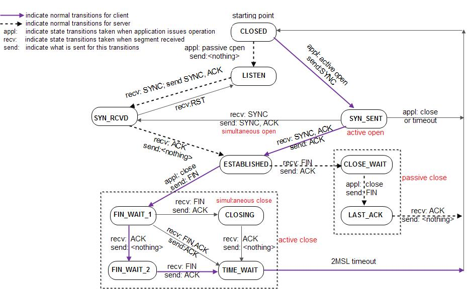

TCP连接的状态图（TCP Connection State Diagram）展示了TCP协议在建立连接、传输数据、关闭连接过程中可能的状态及其转换。了解这些状态对于网络调试、性能优化和网络编程都非常有帮助。

### TCP状态图解释

在TCP连接的生命周期中，有多个状态，以下是主要的TCP连接状态及其转换：

1. **CLOSED**: 初始状态，表示套接字没有被使用或已经关闭。

2. **LISTEN**: 服务器套接字正在监听连接请求。这个状态通常由服务器处于被动打开（Passive Open）状态时进入。

3. **SYN-SENT**: 客户端在发送SYN（同步）包后进入这个状态，等待服务器的SYN-ACK。表示主动打开（Active Open）的一端已经发送了连接请求。

4. **SYN-RECEIVED**: 服务器在接收到客户端的SYN包后，发送SYN-ACK，并进入这个状态，等待客户端的ACK确认。

5. **ESTABLISHED**: 表示连接已经建立，数据可以在客户端和服务器之间双向传输。这个是正常的数据传输状态。

6. **FIN-WAIT-1**: 连接的主动关闭方（通常是客户端）发送FIN（结束）包后进入这个状态，等待对方的ACK。

7. **FIN-WAIT-2**: 主动关闭方接收到ACK后，进入这个状态，等待对方发送FIN包。

8. **CLOSE-WAIT**: 被动关闭方接收到FIN包后，进入这个状态，等待应用程序关闭连接。

9. **CLOSING**: 在极少见的情况下，双方同时发送FIN包时会进入这个状态，等待对方的ACK。

10. **LAST-ACK**: 被动关闭方在发送ACK并等待对方确认后进入这个状态。

11. **TIME-WAIT**: 主动关闭方在发送最后的ACK后，进入这个状态，确保对方收到了ACK，防止旧数据包干扰，保持这个状态2倍的最大报文段寿命时间（通常是2分钟）。

12. **CLOSED**: 所有资源释放后，连接彻底关闭，返回到初始状态。

### 状态转换图

以下是TCP连接状态的转换图：

### 状态转换的简要说明

- **CLOSED** 到 **LISTEN**： 服务器调用`listen()`函数进入`LISTEN`状态，准备接受连接。
- **SYN-SENT**： 客户端调用`connect()`后发送SYN包，进入`SYN-SENT`状态。
- **SYN-RECEIVED**： 服务器接收到SYN包后，回复SYN-ACK，并进入`SYN-RECEIVED`状态。
- **ESTABLISHED**： 双方都接收到对方的确认包后，进入`ESTABLISHED`状态，开始数据传输。
- **FIN-WAIT-1**： 主动关闭方发送FIN包后进入`FIN-WAIT-1`状态。
- **CLOSE-WAIT**： 被动关闭方接收到FIN包后进入`CLOSE-WAIT`状态，等待应用程序关闭连接。
- **LAST-ACK**： 被动关闭方在发送ACK包后进入`LAST-ACK`状态，等待最后的确认。
- **TIME-WAIT**： 主动关闭方在发送最后的ACK包后进入`TIME-WAIT`状态，确保对方接收并释放资源。

### 状态的作用

- **LISTEN**： 服务器等待连接请求的状态。
- **SYN-SENT**/**SYN-RECEIVED**： 建立连接时的握手状态，确保双方都准备好通信。
- **ESTABLISHED**： 连接已建立，数据可以传输。
- **FIN-WAIT-1**/**FIN-WAIT-2**/**CLOSE-WAIT**/**LAST-ACK**/**TIME-WAIT**： 连接关闭时的状态，确保所有数据正确传输，并正确关闭连接。

### 总结

TCP连接状态图详细展示了从连接建立到数据传输，再到连接关闭的整个过程。理解这些状态对于调试网络问题、优化应用程序性能、设计健壮的网络服务非常重要。通过分析TCP连接的状态，可以识别出哪些连接处于非正常状态，并采取相应的措施来修复或优化。